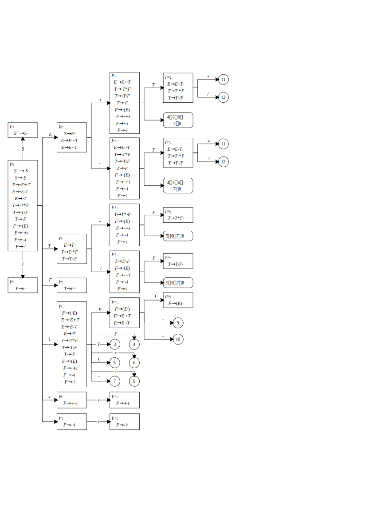

# 简单计算器的设计（LR 分析法）

## 1 课程设计目的

通过设计、编制、调试一个简单计算器程序，加深对语法及语义分析原理的理解，
并实现词法分析程序对单词序列的词法检查和分析。

## 2 课程设计内容及步骤

本次课程设计需要使用 LR 分析法完成简单计算器的设计，其中算术表达式的文法如下：

```
〈无符号整数〉∷＝ 〈数字〉{〈数字〉}
〈标志符〉∷＝ 〈字母〉{〈字母〉｜〈数字〉}
〈表达式〉∷＝［＋｜－］〈项〉{〈加法运算符〉〈项〉}
〈项〉∷＝ 〈因子〉{〈乘法运算符〉〈因子〉}
〈因子〉∷＝ 〈标志符〉｜〈无符号整数〉｜‘（’〈表达式〉‘）’
〈加法运算符〉∷＝ ＋｜－
〈乘法运算符〉∷＝ * ｜／
```

本次课程设计分为如下步骤完成：
1. 根据题目要求的文法写出产生式；
1. 进行文法拓广，根据产生式画出识别活前缀的 `DFA`；
1. 根据 `DFA` 写出 LR(0) 或 SLR(1) 分析表；
1. 编写程序，对输入串进行分析；
1. 设计若干用例，上机测试并通过所设计的分析程序。

## 3 翻译方法

### 3.1 词法分析

词法分析是计算机科学中将字符序列转换为**单词**（Token）序列的过程。进行语法分析的程序或者函数叫作**词法分析器**（Lexical analyzer，简称 Lexer），也叫**扫描器**（Scanner）。词法分析器一般以函数的形式存在，供语法分析器调用。词法分析是编译过程中的第一个阶段，在语法分析前进行。也可以和语法分析结合在一起作为一遍，由语法分析程序调用词法分析程序来获得当前单词供语法分析使用。简化设计、改进编译效率、增加编译系统的可移植性。词法分析是编制一个读单词的过程，从输入的源程序中，识别出各个具有独立意义的单词，即基本保留字、标识符、常数、运算符、分隔符五大类。并依次输出各个单词的内部编码及单词符号自身值。单词的分类主要分为五类：

1. **关键字**：由程序语言定义的具有固定意义的标识符，也称为保留字或基本字。
1. **标识符**：用来表示程序中各种名字的字符串。
1. **常数**：常数的类型一般有整型、实型、布尔型、文字型。
1. **运算符**：如＋、－、*、／等。
1. **界限符**：如逗号、分号、括号等。

这里将词法分析程序设计成一个子程序，每当语法分析程序需要一个单词时，则调用该子程序。词法分析程序每调用一次，便从源程序文件中读入一些字符，直到识别出一个单词。

### 3.2 语法分析

语法分析是编译程序的核心部分，其主要任务是确定语法结构，检查语法错误，报告错误的性质和位置，并进行适当的纠错工作。

语法分析的主要工作是识别由词法分析给出的单词序列是否是给定的正确句子（程序）。语法分析常用的方法自顶向下的语法分析和自底向上的语法分析两大类。此次设计中语法分析中主要通过 LR 分析法对语法分析处理过程进行控制，使表达式结果能正确得出，同时识别语法分析中的语法错误。

语法分析是编译过程的一个逻辑阶段。语法分析的任务是在的基础上将单词序列组合成各类语法短语，如“程序”“语句”“表达式”等等。语法分析程序判断源程序在结构上是否正确。源程序的结构由上下文无关文法描述。语法分析程序可以用 `YACC` 等工具自动生成。

在语法分析的同时可由语法分析程序调用相应的语义子程序进行语义处理，完成附加在所使用的产生式上的语义规则描述，并完成移进—归约过程。

词法分析程序和语法分析程序的关系如图 1 所示：

### 3.3 中间代码生成

中间代码，也称中间语言，是复杂性介于源程序语言和机器语言的一种表示形式。为了使编译程序有较高的目标程序质量，或要求从编译程序逻辑结构上把与机器无关和与机器有关的工作明显的分开来时，许多编译程序都采用了某种复杂性介于源程序语言和机器语言之间的中间语言。中间代码（语言）是一种特殊结构的语言，编译程序所使用的中间代码有多种形式。按其结构分常见的有逆波兰式（后缀式）、三地址代码（三元式、四元式）和树形表示（抽象语法树）、`DAG` 表示。

本次课程设计不需要生成中间代码。

## 4 文法及属性文法描述

### 4.1 文法描述

根据题目要求的文法，产生式如下：
```
（1） S′→ S （文法拓广）
（2） S → E
（3） E → E ＋ T
（4） E → E － T
（5） E → T
（6） T → T * F
（7） T → T / F
（8） T → F
（9） F → (E)
（10）F → ＋i
（11）F → －i
（12）F → i
```

### 4.2 属性文法描述

对该文法的属性文法描述如下：
| 产生式 | 语义规则 |
| ---- | ---- |
| *S* → *E* | print(*E*.val) |
| *E* → *E* ＋ *T* | *E*.val := *E*.val + *T*.val |
| *E* → *E* － *T* | *E*.val := *E*.val - *T*.val |
| *E* → *T* | print(*T*.val) |
| *T* → *T* * *F* | *T*.val := *T*.val * *F*.val |
| *T* → *T* / *F* | *T*.val := *T*.val / *F*.val |
| *T* → *F* | print(*F*.val) |
| *F* → (*E*) | *F*.val := *E*.val |
| *F* → ＋*i* | *F*.val := *i*.lexval |
| *F* → －*i* | *F*.val := -*i*.lexval |
| *F* → *i* | *F*.val := *i*.lexval |

## 5 LR 分析法

### 5.1 LR 分析法概述

LR 分析法是一种能根据当前分析栈中的符号串（通常以状态表示）和向右顺序查看输入串的 *k* 个（*k* ≥ 0）符号就可以唯一地确定分析器的动作是移进还是归约和用哪个产生式归约，因而也就能唯一地确定句柄。LR 分析法的归约过程是规范推导的逆过程，所以 LR 分析过程是一种规范归约的过程。
LR(*k*) 分析方法是 1965 年 Knuth 提出的，括号中的 *k* 表示向右查看输入串符号的个数。这种方法比起自顶向下的 LL(*k*) 分析方法和自底向上的优先分析方法对文法的限制要少得多，也就是说对于大多数用无二义性上下文无关文法描述的语言都可以用相应的 LR 分析器进行识别，而且这种方法还具有分析速度快，能准确、即时地指出出错位置。它的主要缺点是对于一个实用语言文法的分析器的构造工作量相当大，*k* 越大构造越复杂，实现比较困难。因此，目前许多实用的编译程序，都运用了 LR 分析器。

### 5.2 识别活前缀的 DFA

本课程设计根据产生式得到的识别活前缀的 `DFA` 如图 2 所示：



### 5.3 SLR(1) 分析表

根据图 2 可知，*I*<sub>2</sub>、*I*<sub>3</sub>、*I*<sub>16</sub>、*I*<sub>17</sub> 存在移进—归约冲突，可用 SLR(1) 方法解决冲突。

SLR(1) 分析表如下：

<table align="center">
  <thead>
    <tr>
      <th rowspan="2"></th>
      <th colspan="8">ACTION</th>
      <th colspan="4">GOTO</th>
    </tr>
    <tr>
      <th>+</th>
      <th>-</th>
      <th>*</th>
      <th>/</th>
      <th>(</th>
      <th>)</th>
      <th><i>i</i></th>
      <th>#</th>
      <th><i>S</i></th>
      <th><i>E</i></th>
      <th><i>T</i></th>
      <th><i>F</i></th>
    </tr>
  </thead>
  <tbody>
    <tr>
      <td><b>0</b></td>
      <td><i>S</i><sub>6</sub></td>
      <td><i>S</i><sub>7</sub></td>
      <td></td>
      <td></td>
      <td><i>S</i><sub>5</sub></td>
      <td></td>
      <td><i>S</i><sub>8</sub></td>
      <td></td>
      <td>1</td>
      <td>2</td>
      <td>3</td>
      <td>4</td>
    </tr>
    <tr>
      <td><b>1</b></td>
      <td></td>
      <td></td>
      <td></td>
      <td></td>
      <td></td>
      <td></td>
      <td></td>
      <td><i>acc</i></td>
      <td></td>
      <td></td>
      <td></td>
      <td></td>
    </tr>
    <tr>
      <td><b>2</b></td>
      <td><i>S</i><sub>9</sub></td>
      <td><i>S</i><sub>10</sub></td>
      <td></td>
      <td></td>
      <td></td>
      <td></td>
      <td></td>
      <td><i>r</i><sub>2</sub></td>
      <td></td>
      <td></td>
      <td></td>
      <td></td>
    </tr>
    <tr>
      <td><b>3</b></td>
      <td><i>r</i><sub>5</sub></td>
      <td><i>r</i><sub>5</sub></td>
      <td><i>S</i><sub>11</sub></td>
      <td><i>S</i><sub>12</sub></td>
      <td></td>
      <td><i>r</i><sub>5</sub></td>
      <td></td>
      <td><i>r</i><sub>5</sub></td>
      <td></td>
      <td></td>
      <td></td>
      <td></td>
    </tr>
    <tr>
      <td><b>4</b></td>
      <td><i>r</i><sub>8</sub></td>
      <td><i>r</i><sub>8</sub></td>
      <td><i>r</i><sub>8</sub></td>
      <td><i>r</i><sub>8</sub></td>
      <td></td>
      <td><i>r</i><sub>8</sub></td>
      <td></td>
      <td><i>r</i><sub>8</sub></td>
      <td></td>
      <td></td>
      <td></td>
      <td></td>
    </tr>
    <tr>
      <td><b>5</b></td>
      <td><i>S</i><sub>6</sub></td>
      <td><i>S</i><sub>7</sub></td>
      <td></td>
      <td></td>
      <td><i>S</i><sub>5</sub></td>
      <td></td>
      <td><i>S</i><sub>8</sub></td>
      <td></td>
      <td></td>
      <td>13</td>
      <td>3</td>
      <td>4</td>
    </tr>
    <tr>
      <td><b>6</b></td>
      <td></td>
      <td></td>
      <td></td>
      <td></td>
      <td></td>
      <td></td>
      <td><i>S</i><sub>14</sub></td>
      <td></td>
      <td></td>
      <td></td>
      <td></td>
      <td></td>
    </tr>
    <tr>
      <td><b>7</b></td>
      <td></td>
      <td></td>
      <td></td>
      <td></td>
      <td></td>
      <td></td>
      <td><i>S</i><sub>15</sub></td>
      <td></td>
      <td></td>
      <td></td>
      <td></td>
      <td></td>
    </tr>
    <tr>
      <td><b>8</b></td>
      <td><i>r</i><sub>12</sub></td>
      <td><i>r</i><sub>12</sub></td>
      <td><i>r</i><sub>12</sub></td>
      <td><i>r</i><sub>12</sub></td>
      <td></td>
      <td><i>r</i><sub>12</sub></td>
      <td></td>
      <td><i>r</i><sub>12</sub></td>
      <td></td>
      <td></td>
      <td></td>
      <td></td>
    </tr>
    <tr>
      <td><b>9</b></td>
      <td><i>S</i><sub>6</sub></td>
      <td><i>S</i><sub>7</sub></td>
      <td></td>
      <td></td>
      <td><i>S</i><sub>5</sub></td>
      <td></td>
      <td><i>S</i><sub>8</sub></td>
      <td></td>
      <td></td>
      <td></td>
      <td>16</td>
      <td>4</td>
    </tr>
    <tr>
      <td><b>10</b></td>
      <td><i>S</i><sub>6</sub></td>
      <td><i>S</i><sub>7</sub></td>
      <td></td>
      <td></td>
      <td><i>S</i><sub>5</sub></td>
      <td></td>
      <td><i>S</i><sub>8</sub></td>
      <td></td>
      <td></td>
      <td></td>
      <td>17</td>
      <td>4</td>
    </tr>
    <tr>
      <td><b>11</b></td>
      <td><i>S</i><sub>6</sub></td>
      <td><i>S</i><sub>7</sub></td>
      <td></td>
      <td></td>
      <td><i>S</i><sub>5</sub></td>
      <td></td>
      <td><i>S</i><sub>8</sub></td>
      <td></td>
      <td></td>
      <td></td>
      <td></td>
      <td>18</td>
    </tr>
    <tr>
      <td><b>12</b></td>
      <td><i>S</i><sub>6</sub></td>
      <td><i>S</i><sub>7</sub></td>
      <td></td>
      <td></td>
      <td><i>S</i><sub>5</sub></td>
      <td></td>
      <td><i>S</i><sub>8</sub></td>
      <td></td>
      <td></td>
      <td></td>
      <td></td>
      <td>19</td>
    </tr>
    <tr>
      <td><b>13</b></td>
      <td><i>S</i><sub>9</sub></td>
      <td><i>S</i><sub>10</sub></td>
      <td></td>
      <td></td>
      <td></td>
      <td><i>S</i><sub>20</sub></td>
      <td></td>
      <td></td>
      <td></td>
      <td></td>
      <td></td>
      <td></td>
    </tr>
    <tr>
      <td><b>14</b></td>
      <td><i>r</i><sub>10</sub></td>
      <td><i>r</i><sub>10</sub></td>
      <td><i>r</i><sub>10</sub></td>
      <td><i>r</i><sub>10</sub></td>
      <td></td>
      <td><i>r</i><sub>10</sub></td>
      <td></td>
      <td><i>r</i><sub>10</sub></td>
      <td></td>
      <td></td>
      <td></td>
      <td></td>
    </tr>
    <tr>
      <td><b>15</b></td>
      <td><i>r</i><sub>11</sub></td>
      <td><i>r</i><sub>11</sub></td>
      <td><i>r</i><sub>11</sub></td>
      <td><i>r</i><sub>11</sub></td>
      <td></td>
      <td><i>r</i><sub>11</sub></td>
      <td></td>
      <td><i>r</i><sub>11</sub></td>
      <td></td>
      <td></td>
      <td></td>
      <td></td>
    </tr>
    <tr>
      <td><b>16</b></td>
      <td><i>r</i><sub>3</sub></td>
      <td><i>r</i><sub>3</sub></td>
      <td><i>S</i><sub>11</sub></td>
      <td><i>S</i><sub>12</sub></td>
      <td></td>
      <td><i>r</i><sub>3</sub></td>
      <td></td>
      <td><i>r</i><sub>3</sub></td>
      <td></td>
      <td></td>
      <td></td>
      <td></td>
    </tr>
    <tr>
      <td><b>17</b></td>
      <td><i>r</i><sub>4</sub></td>
      <td><i>r</i><sub>4</sub></td>
      <td><i>S</i><sub>11</sub></td>
      <td><i>S</i><sub>12</sub></td>
      <td></td>
      <td><i>r</i><sub>4</sub></td>
      <td></td>
      <td><i>r</i><sub>4</sub></td>
      <td></td>
      <td></td>
      <td></td>
      <td></td>
    </tr>
    <tr>
      <td><b>18</b></td>
      <td><i>r</i><sub>6</sub></td>
      <td><i>r</i><sub>6</sub></td>
      <td><i>r</i><sub>6</sub></td>
      <td><i>r</i><sub>6</sub></td>
      <td></td>
      <td><i>r</i><sub>6</sub></td>
      <td></td>
      <td><i>r</i><sub>6</sub></td>
      <td></td>
      <td></td>
      <td></td>
      <td></td>
    </tr>
    <tr>
      <td><b>19</b></td>
      <td><i>r</i><sub>7</sub></td>
      <td><i>r</i><sub>7</sub></td>
      <td><i>r</i><sub>7</sub></td>
      <td><i>r</i><sub>7</sub></td>
      <td></td>
      <td><i>r</i><sub>7</sub></td>
      <td></td>
      <td><i>r</i><sub>7</sub></td>
      <td></td>
      <td></td>
      <td></td>
      <td></td>
    </tr>
    <tr>
      <td><b>20</b></td>
      <td><i>r</i><sub>9</sub></td>
      <td><i>r</i><sub>9</sub></td>
      <td><i>r</i><sub>9</sub></td>
      <td><i>r</i><sub>9</sub></td>
      <td></td>
      <td><i>r</i><sub>9</sub></td>
      <td></td>
      <td><i>r</i><sub>9</sub></td>
      <td></td>
      <td></td>
      <td></td>
      <td></td>
    </tr>
  </tbody>
</table>

### 5.4 分析过程

LR 分析法的规约过程是规范推到的逆过程，所以 LR 分析过程是一种规范规约的过程。其分析过程为：由文法构造出该文法项目集，再根据项目集构造该文法的 `DFA`，再判断是否有移进—规约和规约—规约冲突，若没有冲突则该文法为 LR(0) 的，若有冲突则该文法是 SLR(1) 的，最后可以构造出 LR(0) 分析表。然后根据 LR(0) 分析表进行语法分析，分析过程就是进栈和规约的过程。若能规约出开始符 *S*，则语法正确。反之，语法错误。

LR 分析法过程流程图如下：

其中 *S<sub>p</sub>* 为栈顶指针，*S*[i]为状态栈，*X*[i]为文法符号栈。状态转换表内容按关系 GOTO[*S<sub>i</sub>*, *X*] = *S<sub>j</sub>*, 确定，改关系式是指当前栈顶状态为 *S<sub>i</sub>* 遇到当前文法符号为 *X* 时应转向状态 *S<sub>j</sub>*。*X* 为终结符或非终结符。

ACTION[*S<sub>i</sub>*, *a*] 规定了栈顶状态为 *S<sub>j</sub>* 时遇到输入符号 *c*[i] 应该执行的动作。动作有以下四种可能：
- **移进**：当 *S<sub>j</sub>* = GOTO[*S<sub>i</sub>*, *a*] 成立，则把 *S<sub>j</sub>* 移入到文法符号栈。其中 *i*，*j* 表示状态号。
- **规约**：当在栈顶形成句柄为 *b* 时，则用 *b* 归约为相应的非终结符 *A*，即当文法中有 *A*→*b* 的产生式，而 *b* 的长度为 *r*，则从状态栈和文法符号栈中自栈顶向下去掉 *r* 个符号。并把 *A* 移入文法符号栈内，再把满足 *S<sub>j</sub>* = GOTO[*S<sub>i</sub>*, *A*] 的状态移进状态栈，其中 *S<sub>i</sub>* 为修改指针后的栈顶状态。
- **接受**：当归约到文法符号栈中只剩下文法的开始符号 *S* 时，并且输入符号串已
- **结束**：即当前输入符是 #，则为分析成功。
- **报错**：当遇到状态栈顶为某一状态下出现不该遇到的文法符号时，则报错，说明输入串不是该分发能接受的句子。

## 6 课程设计结果

本次课程设计采用的文法和产生式：

本次课程设计取了多组测试用例，测试结果如下：

> -0.2*5

> 1+2*3

> 0.6*(18-3)

> -1++-2-3+4*2.5

前三个测试用例输入的是正确的表达式，程序的得出的计算结果也正确。最后一个是错误的表达式，第 4 个位置的加号根据产生式 10 被识别为正号，而后面的减号（或负号）无法被识别，因而程序报错。

## 7 程序评价及心得体会
本次课程设计使用 LR 分析法完成简单计算器的实现。通过对文法的分析，写出了相应产生式，并完成了识别活前缀的 `DFA` 的绘制、SLR(1) 分析表的填写，以及编程实现对输入串的分析过程。并且对题目要求进行了扩展，在词法分析环节加入了对小数的识别，使该计算器支持小数运算。最终通过测试，可验证产生式、分析表和程序的正确性。

本次课程设计通过文件读取将文件内容读入到内存中。由于考虑到可能存在的格式问题，词法分析环节会过滤掉首部和尾部空格，再对输入串进行分析。

通过本次课程设计，我对 LR 分析法有了更深刻的认识，感到受益匪浅。

## 参考文献

1. 张素琴，吕映之，蒋维杜，戴桂兰．编译原理（第二版）［M］．北京：清华大学出版社 2005.2．
1. ［美］Alfred V.Aho，Monica S.Lam，Ravi Sethi，Jeffrey D.Ullman．编译原理［M］．北京：机械工业出版社，2009.1.1．
1. ［美］Andrew W.Appel．现代编译原理：C 语言描述［M］．北京：人民邮电出版社，2006.4.1．
1. ［美］Steven S.Muchnick 著，赵克佳，沈志宇译．高级编译器设计与实现［M］．北京：机械工业出版社，2005.7.3．